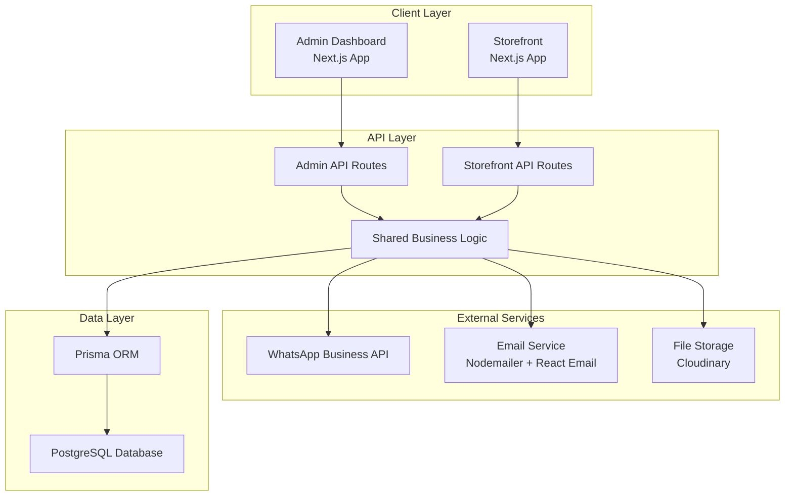

# Design Document

## Overview

The Gloopi B2B & B2C platform is a comprehensive e-commerce solution designed specifically for industrial glove sales in Indonesia. The system operates on a quotation-based business model rather than direct payments, serving both individual customers (B2C) and business clients (B2B) in medical, manufacturing, and food industries.

### Key Design Principles

- **Quotation-First Workflow**: All purchases flow through quotation requests rather than direct checkout
- **Dual Customer Types**: Seamless handling of both B2B and B2C customers with different requirements
- **Indonesian Localization**: Full Indonesian language support and IDR currency formatting
- **Communication-Centric**: Integrated WhatsApp and phone communication for sales follow-up
- **Compliance-Ready**: Built-in PPN tax invoice generation following Indonesian standards

### Business Model

The platform replaces traditional e-commerce checkout with a quotation request system where:
1. Customers browse products and add items to cart
2. Instead of payment, customers submit Purchase Order (PO) requests
3. Admin reviews and converts quotations to sales orders
4. Invoices are generated and payment is handled offline
5. Orders are fulfilled with manual tracking number input

## Architecture

### System Architecture

The platform follows a monorepo architecture with two main applications sharing common packages and database:



### Application Structure

**Admin Dashboard (`apps/admin`)**
- Quotation and PO management interface
- Sales order and invoice management
- Customer and company profile management
- Communication tools (WhatsApp, phone integration)
- Analytics and reporting dashboard
- PPN tax invoice generation

**Storefront (`apps/storefront`)**
- Public landing page with industry focus
- Product catalog with filtering capabilities
- Shopping cart with PO request flow
- Customer portal for order/invoice tracking
- Tax invoice request interface

### Technology Stack Integration

Building on the existing technology stack:
- **Framework**: Next.js 14 with App Router for both applications
- **Database**: PostgreSQL with Prisma ORM for type-safe database operations
- **Authentication**: JWT with httpOnly cookies using Jose library
- **UI Components**: Radix UI primitives with shadcn/ui components
- **Styling**: TailwindCSS with consistent design system
- **Communication**: WhatsApp Business API integration
- **Email**: React Email templates with Nodemailer
- **File Management**: Cloudinary for product images and document storage

## Components and Interfaces

### Core Business Components

#### Quotation Management System
```typescript
interface QuotationManager {
  createQuotation(request: PORequest): Promise<Quotation>
  updateQuotationStatus(id: string, status: QuotationStatus): Promise<void>
  convertToOrder(quotationId: string): Promise<Order>
  getQuotationsByStatus(status: QuotationStatus): Promise<Quotation[]>
  scheduleFollowUp(quotationId: string, date: Date): Promise<void>
}
```

#### Order Processing System
```typescript
interface OrderProcessor {
  createOrderFromQuotation(quotationId: string): Promise<Order>
  updateOrderStatus(orderId: string, status: OrderStatus): Promise<void>
  generateInvoice(orderId: string): Promise<Invoice>
  addTrackingNumber(orderId: string, trackingNumber: string): Promise<void>
  processPayment(invoiceId: string, paymentDetails: PaymentInfo): Promise<void>
}
```

#### Customer Management System
```typescript
interface CustomerManager {
  createCustomer(data: CustomerData): Promise<Customer>
  updateCustomerProfile(id: string, data: Partial<CustomerData>): Promise<void>
  getCustomerHistory(customerId: string): Promise<CustomerHistory>
  validateTaxInformation(taxInfo: TaxInfo): Promise<boolean>
  linkCompanyProfile(customerId: string, companyId: string): Promise<void>
}
```

#### Communication System
```typescript
interface CommunicationManager {
  sendWhatsAppMessage(phoneNumber: string, template: string, params: any): Promise<void>
  logCommunication(customerId: string, type: CommunicationType, content: string): Promise<void>
  scheduleFollowUp(customerId: string, date: Date, type: FollowUpType): Promise<void>
  getCustomerCommunicationHistory(customerId: string): Promise<Communication[]>
}
```

### User Interface Components

#### Admin Dashboard Components
- **QuotationDashboard**: Overview of pending, approved, and converted quotations
- **OrderManagement**: Order status tracking and fulfillment interface
- **CustomerProfiles**: Comprehensive customer and company information management
- **CommunicationPanel**: WhatsApp and phone integration with communication history
- **AnalyticsDashboard**: Business metrics and performance indicators
- **InvoiceGenerator**: PPN tax invoice creation and management

#### Storefront Components
- **ProductCatalog**: Filterable product display with industry-specific categorization
- **ShoppingCart**: Cart management with PO request functionality
- **CustomerPortal**: Order tracking and invoice management interface
- **LandingPage**: Industry-focused value proposition and navigation
- **TaxInvoiceRequest**: Interface for requesting PPN documentation

### Integration Interfaces

#### WhatsApp Business API Integration
```typescript
interface WhatsAppService {
  sendTemplateMessage(to: string, templateName: string, params: any): Promise<string>
  sendTextMessage(to: string, message: string): Promise<string>
  handleIncomingWebhook(payload: WhatsAppWebhook): Promise<void>
  createMessageTemplate(template: MessageTemplate): Promise<void>
}
```

#### Email Service Integration
```typescript
interface EmailService {
  sendQuotationConfirmation(customer: Customer, quotation: Quotation): Promise<void>
  sendOrderUpdate(customer: Customer, order: Order): Promise<void>
  sendInvoiceNotification(customer: Customer, invoice: Invoice): Promise<void>
  sendTaxInvoiceReady(customer: Customer, taxInvoice: TaxInvoice): Promise<void>
}
```

## Data Models

### Core Entity Models

#### Customer and Company Models
```typescript
// Customer entity for both B2B and B2C
interface Customer {
  id: string
  email: string
  phone: string
  name: string
  type: 'B2B' | 'B2C'
  companyId?: string // Optional for B2B customers
  addresses: Address[]
  taxInformation?: TaxInformation
  communicationPreferences: CommunicationPreferences
  createdAt: Date
  updatedAt: Date
}

// Company entity for B2B customers
interface Company {
  id: string
  name: string
  registrationNumber: string
  taxId: string // NPWP for Indonesian companies
  industry: 'medical' | 'manufacturing' | 'food' | 'other'
  address: Address
  contactPerson: string
  customers: Customer[] // Multiple users can belong to one company
  createdAt: Date
  updatedAt: Date
}
```

#### Product and Catalog Models
```typescript
interface Product {
  id: string
  sku: string
  name: string
  description: string
  category: ProductCategory
  useCase: 'medical' | 'manufacturing' | 'food'
  specifications: ProductSpecification[]
  images: string[]
  pricing: PricingTier[]
  isActive: boolean
  createdAt: Date
  updatedAt: Date
}

interface ProductCategory {
  id: string
  name: string
  description: string
  parentId?: string
  children?: ProductCategory[]
}

interface PricingTier {
  id: string
  minQuantity: number
  maxQuantity?: number
  pricePerUnit: number // In IDR cents for precision
  currency: 'IDR'
}
```

#### Quotation and Order Models
```typescript
interface Quotation {
  id: string
  quotationNumber: string // Auto-generated unique identifier
  customerId: string
  customer: Customer
  items: QuotationItem[]
  status: 'pending' | 'approved' | 'rejected' | 'converted'
  totalAmount: number // In IDR cents
  shippingAddress?: Address
  notes?: string
  validUntil: Date
  createdAt: Date
  updatedAt: Date
  convertedOrderId?: string
  communications: Communication[]
  followUps: FollowUp[]
}

interface QuotationItem {
  id: string
  productId: string
  product: Product
  quantity: number
  unitPrice: number // In IDR cents
  totalPrice: number // In IDR cents
  notes?: string
}

interface Order {
  id: string
  orderNumber: string
  quotationId: string
  quotation: Quotation
  customerId: string
  customer: Customer
  items: OrderItem[]
  status: 'new' | 'processing' | 'shipped' | 'delivered' | 'cancelled'
  totalAmount: number // In IDR cents
  shippingAddress: Address
  trackingNumber?: string
  shippedAt?: Date
  deliveredAt?: Date
  invoice?: Invoice
  createdAt: Date
  updatedAt: Date
}
```

#### Invoice and Tax Models
```typescript
interface Invoice {
  id: string
  invoiceNumber: string
  orderId: string
  order: Order
  customerId: string
  customer: Customer
  items: InvoiceItem[]
  subtotal: number // In IDR cents
  taxAmount: number // In IDR cents (if applicable)
  totalAmount: number // In IDR cents
  status: 'pending' | 'paid' | 'overdue' | 'cancelled'
  dueDate: Date
  paidAt?: Date
  paymentMethod?: string
  taxInvoiceRequested: boolean
  taxInvoice?: TaxInvoice
  createdAt: Date
  updatedAt: Date
}

interface TaxInvoice {
  id: string
  taxInvoiceNumber: string // Following Indonesian PPN format
  invoiceId: string
  invoice: Invoice
  customerId: string
  customer: Customer
  companyId: string
  company: Company
  ppnRate: number // Usually 11% in Indonesia
  ppnAmount: number // In IDR cents
  totalWithPPN: number // In IDR cents
  issuedAt: Date
  createdAt: Date
  updatedAt: Date
}
```

#### Communication and Follow-up Models
```typescript
interface Communication {
  id: string
  customerId: string
  customer: Customer
  quotationId?: string
  orderId?: string
  type: 'whatsapp' | 'phone' | 'email'
  direction: 'inbound' | 'outbound'
  content: string
  status: 'sent' | 'delivered' | 'read' | 'failed'
  createdAt: Date
  createdBy: string // Admin user ID
}

interface FollowUp {
  id: string
  customerId: string
  customer: Customer
  quotationId?: string
  orderId?: string
  type: 'quotation_follow_up' | 'payment_reminder' | 'delivery_update'
  scheduledAt: Date
  completedAt?: Date
  notes?: string
  status: 'pending' | 'completed' | 'cancelled'
  createdAt: Date
  createdBy: string // Admin user ID
}
```

### Database Schema Design

The database schema will be implemented using Prisma with the following key relationships:

```prisma
// Core customer and company relationships
model Customer {
  id        String   @id @default(cuid())
  email     String   @unique
  phone     String
  name      String
  type      CustomerType
  companyId String?
  company   Company? @relation(fields: [companyId], references: [id])
  
  quotations     Quotation[]
  orders         Order[]
  invoices       Invoice[]
  communications Communication[]
  followUps      FollowUp[]
  
  createdAt DateTime @default(now())
  updatedAt DateTime @updatedAt
}

// Quotation workflow
model Quotation {
  id               String          @id @default(cuid())
  quotationNumber  String          @unique
  customerId       String
  customer         Customer        @relation(fields: [customerId], references: [id])
  status           QuotationStatus
  totalAmount      Int             // IDR in cents
  convertedOrderId String?         @unique
  convertedOrder   Order?          @relation(fields: [convertedOrderId], references: [id])
  
  items          QuotationItem[]
  communications Communication[]
  followUps      FollowUp[]
  
  createdAt DateTime @default(now())
  updatedAt DateTime @updatedAt
}

// Order and fulfillment
model Order {
  id            String      @id @default(cuid())
  orderNumber   String      @unique
  quotationId   String      @unique
  quotation     Quotation   @relation(fields: [quotationId], references: [id])
  status        OrderStatus
  trackingNumber String?
  
  items   OrderItem[]
  invoice Invoice?
  
  createdAt DateTime @default(now())
  updatedAt DateTime @updatedAt
}
```

## Error Handling

### Error Classification

#### Business Logic Errors
- **QuotationError**: Invalid quotation operations (expired, already converted)
- **OrderError**: Invalid order state transitions
- **CustomerError**: Invalid customer data or permissions
- **InvoiceError**: Invoice generation or payment processing errors
- **CommunicationError**: WhatsApp or email delivery failures

#### Integration Errors
- **WhatsAppAPIError**: WhatsApp Business API communication failures
- **EmailServiceError**: Email delivery service failures
- **PaymentError**: Payment processing integration errors
- **FileUploadError**: Cloudinary or file storage errors

#### System Errors
- **DatabaseError**: Database connection or query failures
- **AuthenticationError**: JWT token or session validation errors
- **ValidationError**: Input validation and schema validation errors
- **RateLimitError**: API rate limiting and throttling errors

### Error Handling Strategy

#### Client-Side Error Handling
```typescript
// Centralized error handling with user-friendly messages in Indonesian
interface ErrorHandler {
  handleBusinessError(error: BusinessError): UserMessage
  handleIntegrationError(error: IntegrationError): UserMessage
  handleSystemError(error: SystemError): UserMessage
  logError(error: Error, context: ErrorContext): void
}

// Indonesian error messages
const ERROR_MESSAGES = {
  QUOTATION_EXPIRED: 'Penawaran telah kedaluwarsa. Silakan buat permintaan baru.',
  INVALID_PHONE: 'Nomor telepon tidak valid. Pastikan format nomor benar.',
  WHATSAPP_FAILED: 'Gagal mengirim pesan WhatsApp. Silakan coba lagi.',
  INVOICE_GENERATION_FAILED: 'Gagal membuat faktur. Silakan hubungi admin.',
}
```

#### Server-Side Error Handling
```typescript
// API error responses with consistent structure
interface APIErrorResponse {
  success: false
  error: {
    code: string
    message: string
    details?: any
  }
  timestamp: string
  requestId: string
}

// Error logging and monitoring
interface ErrorLogger {
  logError(error: Error, context: RequestContext): void
  logBusinessEvent(event: BusinessEvent): void
  logIntegrationFailure(service: string, error: Error): void
}
```

### Retry and Recovery Mechanisms

#### Communication Retry Logic
- WhatsApp messages: 3 retries with exponential backoff
- Email delivery: 5 retries with increasing delays
- Phone call integration: Manual retry with admin notification

#### Data Consistency
- Database transactions for multi-step operations
- Idempotent API endpoints for safe retries
- Event sourcing for critical business operations

## Testing Strategy

### Unit Testing

#### Business Logic Testing
```typescript
// Quotation management tests
describe('QuotationManager', () => {
  test('should create quotation from PO request', async () => {
    const poRequest = createMockPORequest()
    const quotation = await quotationManager.createQuotation(poRequest)
    expect(quotation.status).toBe('pending')
    expect(quotation.items).toHaveLength(poRequest.items.length)
  })

  test('should convert approved quotation to order', async () => {
    const quotation = await createApprovedQuotation()
    const order = await quotationManager.convertToOrder(quotation.id)
    expect(order.quotationId).toBe(quotation.id)
    expect(order.status).toBe('new')
  })
})

// Currency formatting tests
describe('CurrencyFormatter', () => {
  test('should format IDR currency correctly', () => {
    expect(formatIDR(1000000)).toBe('Rp 1.000.000')
    expect(formatIDR(500)).toBe('Rp 500')
  })
})
```

#### Integration Testing
```typescript
// WhatsApp integration tests
describe('WhatsAppService', () => {
  test('should send template message successfully', async () => {
    const mockResponse = { id: 'msg_123' }
    mockWhatsAppAPI.post.mockResolvedValue(mockResponse)
    
    const result = await whatsAppService.sendTemplateMessage(
      '+6281234567890',
      'quotation_approved',
      { customerName: 'John Doe' }
    )
    
    expect(result).toBe('msg_123')
  })
})

// Database integration tests
describe('Database Operations', () => {
  test('should create customer with company relationship', async () => {
    const company = await createTestCompany()
    const customer = await createTestCustomer({ companyId: company.id })
    
    const customerWithCompany = await prisma.customer.findUnique({
      where: { id: customer.id },
      include: { company: true }
    })
    
    expect(customerWithCompany.company.id).toBe(company.id)
  })
})
```

### End-to-End Testing

#### User Journey Testing
```typescript
// Complete quotation to order flow
describe('Quotation to Order Flow', () => {
  test('customer can request quotation and admin can convert to order', async () => {
    // Customer submits PO request
    await storefront.submitPORequest(mockPORequest)
    
    // Admin reviews and approves quotation
    const quotations = await admin.getPendingQuotations()
    await admin.approveQuotation(quotations[0].id)
    
    // Admin converts to order
    const order = await admin.convertQuotationToOrder(quotations[0].id)
    
    // Verify order creation
    expect(order.status).toBe('new')
    expect(order.quotationId).toBe(quotations[0].id)
  })
})

// Communication flow testing
describe('Customer Communication Flow', () => {
  test('admin can send WhatsApp follow-up and log communication', async () => {
    const quotation = await createTestQuotation()
    
    // Send WhatsApp message
    await admin.sendWhatsAppFollowUp(quotation.customerId, 'follow_up_template')
    
    // Verify communication logged
    const communications = await admin.getCustomerCommunications(quotation.customerId)
    expect(communications).toHaveLength(1)
    expect(communications[0].type).toBe('whatsapp')
  })
})
```

### Performance Testing

#### Load Testing Scenarios
- Concurrent quotation submissions
- Bulk order processing
- WhatsApp message sending at scale
- Report generation under load

#### Database Performance
- Query optimization for customer lookups
- Index optimization for order searches
- Pagination performance for large datasets

### Security Testing

#### Authentication and Authorization
- JWT token validation and expiration
- Role-based access control testing
- Session management security

#### Data Protection
- PII data encryption validation
- SQL injection prevention
- XSS protection verification

#### Integration Security
- WhatsApp API authentication security
- Email service credential protection
- File upload security validation

This comprehensive design provides a solid foundation for implementing the Gloopi B2B & B2C platform while ensuring scalability, maintainability, and compliance with Indonesian business requirements.